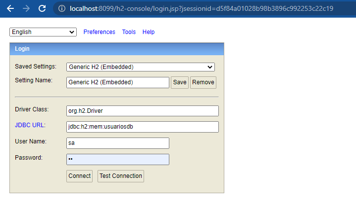
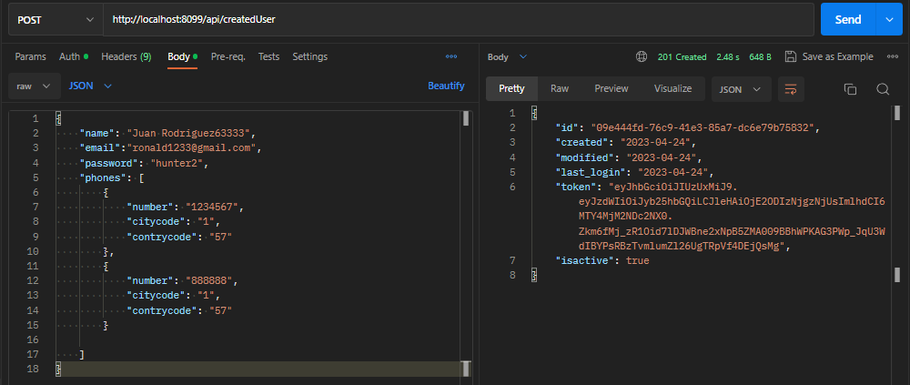

### MICROSERVICIO DE USER MANAGEMENT

- Servicio que crea usuarios.

Tener en cuenta las siguientes configuraciones :

- El servicio se manejará en el puerto 8099  para pruebas locales.
- Las configuraciones  de la base de datos en memoria (H2) .
- Las configuraciones de usuario para el manejo de seguridad de los microservicios .
- Finalmente tenemos las configuración para utilizar las librerías para implementar   	swagger en el proyecto.

####API TOKEN :

- Servicio que  generará un token  mediante un usuario y contraseña configurada.
- Este token será utilizado por el microservicio de user management.

####Prueba del flujo de token.

CASO I :  ERROR 401 - UNAUTHORIZED

CASO II : EXITOSO.

####Prueba del flujo del servicio de user-managemet

Tener en cuenta  los siguientes campos a crear :

Campos a considerar en la BD: usuariosdb    y tb :  user_nisum 

|  CAMPO | DESCRIPCIÓN  |
| ------------ | ------------ |
|  ID |  Identificar del usuario creado  en formato UUID |
|  PHONES | Detalle de líneas telefónicas |
| CREATED  | Fecha de creación del usuario  |
| EMAIL  | Correo del usuario  |
| ISACTIVE |Indica si el usuario sigue habilitado dentro del sistema. |
|LAST_LOGIN   | Coincide con la fecha de creación del usuario  |
| MODIFIED  | fecha de la última actualización de usuario  |
|NAME   |  Nombre del usuario |
|PASSWORD   | Clave del usuario   |
|TOKEN |  Sas Token que viene el servicio que genera token.  | |

Levatamos el proyecto  en el puerto 8099:

Visualizamos el login de H2 :

Obtenemos la BD: usuariosdb    y tb :  user_nisum :

Probamos el servicio en postman:

CASO 1 : ERROR 401 - UNAUTHORIZED

Para ello obetner el token del servicio de api token  :

CASO 2:  CASO EXITOSO  201 - CREATED

y está se registrará en la tb user_nisum :

CASO 3 : Correo en formato inválido :

CASO 4 : Cuando el campo email es requerido :

CASO 5 : El correo ya está registrado:

